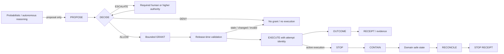
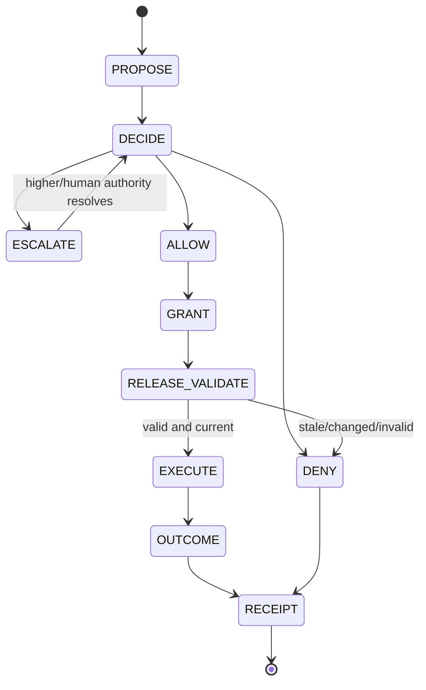
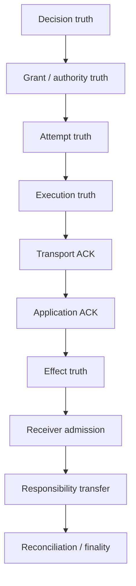
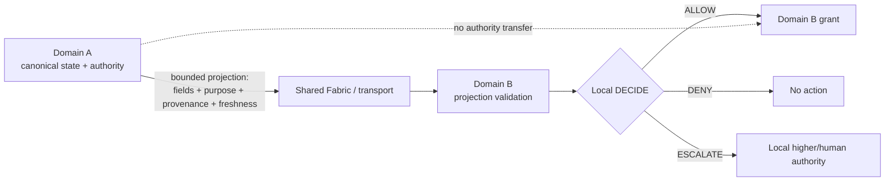
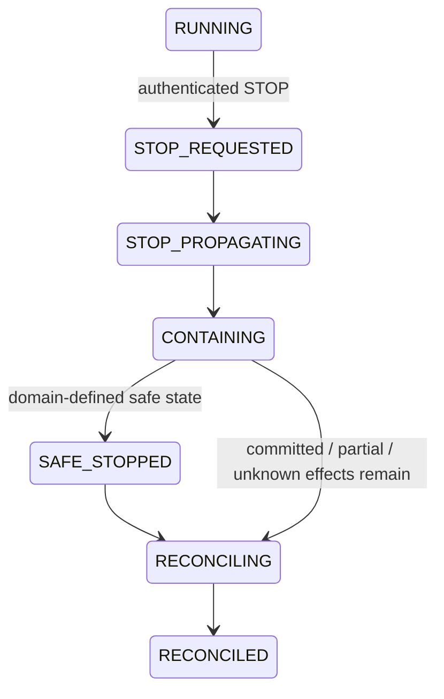

# SnapSpace: Bounded Authority and Verifiable Consequence Control for Autonomous AI Systems

> **Public-safe derivative.** This document preserves the scientific model, methods, results, limitations and claim ceilings while withholding internal source topology, executable reproduction paths, exact implementation identities and other unnecessary reconstruction detail. The complete internal publication record remains separately retained.

**Status:** public-safe technical paper candidate — not published

**Evidence cutoff:** 12 September 2026

**Evidence basis:** internally version-pinned evidence pack with an evidence cutoff of 12 September 2026. Public evidence identifiers and claim ceilings are listed in the accompanying `EVIDENCE_MAP.md` and `CLAIM_LEDGER.md`.

## 1. Abstract

Autonomous and probabilistic reasoning systems create a systems-control problem that is distinct from ordinary model inference: a model may produce a plausible action proposal without possessing legitimate authority to cause the corresponding external effect. Between proposal and consequence, material can change, authority can expire, state can become stale, messages can be replayed, execution can race, acknowledgements can become ambiguous, partial effects can occur, and active work may need to be interrupted. Treating model output, permission, transport success, application acknowledgement and real-world effect as one notion of “success” makes these failures difficult to control or audit.

SnapSpace addresses this problem as **consequence control**, not as an attempt to make AI reasoning deterministic. Its normal control path is `PROPOSE → DECIDE → ALLOW / DENY / ESCALATE`. Only an effective `ALLOW` may produce a bounded `GRANT`, after which `GRANT → EXECUTE → OUTCOME → RECEIPT` is permitted. Active consequential execution has a separate interrupt path: `STOP → CONTAIN → SAFE STATE → RECONCILE → STOP RECEIPT`. Across sovereign domains, the federation rule is `SHARE STATE, NOT AUTHORITY`: bounded state may cross a domain boundary, but the receiving domain retains its own admission and decision authority.

This paper formalises that model, identifies its safety/control invariants, separates decision, authority, attempt, execution, acknowledgement, effect, responsibility-transfer and reconciliation truth, and evaluates the architecture against current bounded evidence. The strongest shared results include a common control contract (`32/32 PASS`), consequential-action receipt contract (`18/18`), bounded projection (`14/14`), bounded local integration (`17/17`), authenticated end-to-end composition (`32/32 ×2` with stable semantic sequence), and a sealed bounded-federation composition qualification (`48/48`, with `9/9` sealed artifacts verified). Additional evidence includes a 409,600-represented-server / 15-kernel software-SIL stress point, a real two-GPU CUDA/NCCL run on one physical host, synthetic institutional handoff experiments, bounded translation experiments, and closed-loop underwater physical-simulator qualification.

The evidence is intentionally bounded. It does not prove universal agent safety, arbitrary federation, external-world exactly-once effects, production or national deployment, live clinical acceptance, universal physical safe states, or physical autonomy. A material implementation conflict is also retained: the current legacy SnapSpace REST path uses process-local volatile state and therefore is **not qualified** for restart-durable or durable exactly-once claims despite stronger wording in its integration documentation. The paper’s central claim is narrower: probabilistic reasoning can be separated from consequential authority, and deterministic control contracts can preserve bounded authority, interruption, uncertainty and evidence semantics across tested software compositions without pretending that unobserved external reality is known.

## 2. Problem Statement

### 2.1 Consequential autonomy is not ordinary inference

A language model, planner, optimiser or learned policy normally produces information: a token sequence, score, trajectory, action candidate or plan. A consequential autonomous system crosses an additional boundary when that information is allowed to mutate software, spend money, operate infrastructure, transmit institutional records, invoke privileged tools, move a vehicle or otherwise affect an external state. The primary systems question is therefore not only whether the reasoning is good, but **who or what is authorised to convert a proposal into consequence, under which exact state, and how that conversion is interrupted and evidenced**.

The distinction matters because consequence occurs in a changing world. An `ALLOW` decision can be correct at time \(t_d\) yet unsafe at release time \(t_r\) if the material, source state, principal, policy, target or environment has changed. A valid command can be replayed. Two workers can race. A network timeout can leave the caller unable to distinguish “not applied” from “applied but reply lost.” An acknowledgement can prove message receipt without proving application, external effect or transfer of responsibility. A process can crash after an irreversible side effect but before recording local completion. A human can approve one object and accidentally release another. A remote domain can receive trustworthy state while still lacking authority to act on it.

These are familiar distributed-systems and security concerns, but autonomous systems amplify them because the producer of the action proposal may be probabilistic, adaptive, partially observed, or explicitly untrusted. Prior work on reference monitors, least privilege, capabilities, remote procedure calls, end-to-end correctness, Sagas and runtime assurance establishes important pieces of the design space [R1–R12]. Recent AI-safety and AI-control work further motivates separation between powerful model behaviour and trusted control mechanisms [R13–R15]. SnapSpace’s question is how to compose these concerns around a **consequence boundary** with evidence that remains truthful under uncertainty.

### 2.2 Failure modes created by collapsing truth

A common implementation shortcut is to collapse several facts into one success flag. For example, `ALLOW=true`, HTTP `200`, queue acknowledgement, worker completion and “effect happened” may all be treated as equivalent. They are not. The collapse is unsafe because each fact belongs to a different boundary and can diverge from the others.

The architecture therefore treats the following as distinct questions: Was the proposal allowed? Was a valid grant issued for the exact material and state? Was an attempt created? Did execution start? Did the transport acknowledge? Did the application acknowledge? Did the external effect occur? Did a receiving domain admit the effect? Did responsibility transfer? Is the result final or still awaiting reconciliation? Section 7 formalises this truth ladder.

### 2.3 Design objective

The design objective is not to guarantee that every proposed action is correct. It is to ensure that **consequential execution is reachable only through an explicit, bounded authority path**, that authority is revalidated against current material/context before release, that active work has a separate authenticated interrupt path, and that post-execution evidence never claims more certainty than the system actually possesses.

The resulting architecture is deliberately fail-closed on missing authority and deliberately non-final on unknown external effects. This can reduce availability or liveness in ambiguous conditions. That trade-off is intentional: the system prefers `DENY`, `ESCALATE`, STOP, or open reconciliation to fabricating authority or certainty.

## 3. Threat and Failure Model

### 3.1 In-scope faults and adversarial conditions

The model assumes that proposals, messages, state, authority objects and execution requests can be malformed, stale, duplicated, replayed, raced, reordered, rebound to different material, or presented under the wrong principal or authority. It also assumes that processes can crash, networks can lose or delay replies, external systems can acknowledge ambiguously, and execution can stop after a partial or irreversible effect.

The architecture specifically addresses: malicious or malformed input; accidental replay; concurrent execution; stale authority; changed material; changed source state; principal or authority substitution; expired grants; release-context rebinding; process crash; network ambiguity; partial effect; transport/application acknowledgement disagreement; uncertain external effect; receiver-admission disagreement; responsibility-transfer ambiguity; foreign-domain authority injection; and STOP issued during active work.

### 3.2 Threat/failure matrix

| Failure class | Unsafe collapse | Control response | Tested evidence | Current ceiling |
|---|---|---|---|---|
| Malformed/rebound proposal | “Looks equivalent” | canonical identity/material binding | E1, E3 | bounded software |
| Replay/duplicate | second request treated as new effect | stable identities + replay/temporal rejection | E3, E4, E8, E9 | tested paths only |
| Stale authority/context | old ALLOW still releases | release-time currentness check | E1, E3, E4 | bounded software |
| Concurrent/racing work | multiple independent effects | attempt/effect identity + owning commit semantics | E3; component-specific proofs | no universal external exactly-once |
| Lost/ambiguous reply | ACK timeout means “did not happen” | `UNKNOWN_EFFECT` + same-attempt reconciliation | E2, E4, E8, E9 | tested contracts/fixtures |
| Partial effect | completion flag hides residue | typed partial/unknown dispositions | E2, E5 | bounded software/SIL |
| Receiver disagreement | delivery equals acceptance | independent admission + responsibility-transfer truth | E8 | synthetic handoff |
| Foreign-domain authority | shared state becomes permission | bounded projection + receiver-local authority | E6, E7 | bounded federation |
| Active unsafe work | normal DENY used too late | authenticated STOP + containment lifecycle | E5 | software/SIL |
| Crash/restart | volatile state treated as durable | durability must be separately demonstrated | E13 identifies conflict | legacy REST claim withheld |

### 3.3 Explicitly outside scope

This paper does not assume or prove a correct model objective, truthful model reasoning, absence of hallucination, optimal policy selection, perfect human judgement, universal identity/personhood assurance, Byzantine consensus across arbitrary participants, or safe physical control for untested plants. It does not treat a signature as proof that an action is wise; a signature or grant can only bind authority under the stated policy/context. It does not treat a receipt as omniscient external-world truth; the receipt must be able to say that truth is unknown.

Physical safety is especially domain-specific. The common STOP semantics can specify revocation, containment and reconciliation, but a “safe state” for a subprocess, hospital workflow, data-centre workload and underwater vehicle is not interchangeable. The common architecture therefore requires each consequence domain to define and qualify its own safe-state behaviour.

## 4. Formal Control Model

### 4.1 Entities and identifiers

Let a **sovereign domain** \(D\) be a control domain that maintains its own authoritative state \(S_D\), decision authority \(A_D\), execution boundary \(X_D\), STOP semantics \(T_D\), reconciliation process \(R_D\), and evidence store \(E_D\). Domains may exchange state but do not implicitly share authority.

A **principal** \(p\) is an entity on whose behalf authority may be evaluated or exercised. A **proposal** \(q\) is a non-authoritative request describing a candidate consequential action. Each proposal is bound to a stable **action identity** \(a\), material digest \(m\), source-state reference \(s\), target/domain \(d\), principal \(p\), and requested consequence scope \(c\).

A **decision** is \( \delta \in \{ALLOW, DENY, ESCALATE\} \). `ESCALATE` means the current authority level cannot safely decide and must route to a required higher or human authority. It is not authority to execute. Only an effective `ALLOW` may create a **grant** \(g\).

A grant is represented abstractly as a bounded authority object that binds the authorised action, principal, consequence scope, relevant material and state context, and a finite validity condition. The precise canonicalisation, wire schema and identity construction are implementation details; the scientific invariant is that authority must not silently widen or survive a material/context change.

An **attempt** \(u\) is the durable identity of one consequential execution attempt under a grant. `attempt_id` is distinct from `action_id`: one describes the logical action, the other identifies the particular attempt whose effect truth must later be reconciled. An **execution** \(x\) is the actual invocation of a consequential mechanism under a current valid grant. An **acknowledgement** \(k\) is evidence that some transport or application boundary reports receipt/completion; it is not by definition an external effect.

An **effect** \(e\) is the consequential state change outside the decision object itself. The effect truth domain must permit at least `NOT_APPLIED`, `APPLIED_CONFIRMED`, `PARTIAL`, and `UNKNOWN_EFFECT` or equivalent source-native states. An **outcome** \(o\) is the best supported statement about execution/effect state. A **receipt** \(r\) binds the evidence known about decision, grant, attempt, execution, acknowledgement, effect and reconciliation. A receipt is invalid if it manufactures certainty that its evidence does not support.

### 4.2 Release predicate

Let `Current(g,t)` mean the grant is still valid at release time; `Match(g,q,S_D)` mean the material and required release context still match the authority decision; and `Permit_D(g)` mean the releasing domain recognises the authority. Consequential release is permitted only if:

\[
Release(g,q,S_D,t) = (\delta=ALLOW) \land Current(g,t) \land Match(g,q,S_D) \land Permit_D(g)
\]

If any conjunct is false or unknowable under a required invariant, release fails closed. In the public decision vocabulary this produces `DENY` or `ESCALATE` according to the owning policy; it does not silently widen an old grant.

### 4.3 STOP model

STOP is not a value of \(\delta\). It is a separate authenticated interrupt over already-active work. Let \(u\) be an active attempt and \(z\) a STOP request bound to scope \(C_z\). A valid STOP causes the control system to revoke further authority in scope, interrupt what remains technically interruptible, propagate to delegated children where defined, prevent later effects where possible, drive the system toward a domain-defined safe state, and reconcile committed/partial/unknown effects.

The lifecycle is represented as:

`RUNNING → STOP_REQUESTED → STOP_PROPAGATING → CONTAINING → SAFE_STOPPED → RECONCILING → RECONCILED`.

Not every domain must expose every internal state label, but the semantics require that STOP not rewrite an already irreversible effect as if it never occurred.

### 4.4 Bounded projection

A **bounded projection** \(\pi_{A\rightarrow B}\) is a signed or otherwise integrity-bound representation of selected state from source domain \(A\) for consumption by domain \(B\). It contains an explicit field set \(F\), purpose \(P\), provenance \(V\), freshness/expiry \(T\), and source-state identity \(S_A\). It may inform \(B\), but it is not a grant issued by \(B\).

The key separation is:

\[
ValidProjection(\pi_{A\rightarrow B}) \not\Rightarrow Authority_B(action)
\]

Instead, the receiving domain validates the projection, admits or rejects it under local rules, combines it with local authoritative state, and makes its own `ALLOW / DENY / ESCALATE` decision. This is the formal meaning of **SHARE STATE, NOT AUTHORITY**.

### Figure 1 — Overall control architecture

The diagram is a control topology, not a claim that every implementation is one process or that every domain exposes identical APIs.

## 5. Safety and Control Invariants

The architecture is evaluated through invariants rather than through a claim that the entire autonomous system is deterministic. Each invariant has explicit assumptions, mechanism, evidence and limits.

| Invariant | Assumptions | Mechanism | Evidence | Known limit |
|---|---|---|---|---|
| I1. No consequential release without effective authority | trusted release boundary executes the validator it claims to execute | ALLOW-only grant topology; exact binding; currentness check | E1, E3, E4 | does not prove policy correctness |
| I2. Authority does not silently widen | grant fields/context are integrity-bound and checked | scope/material/state/principal binding | E1, E6 | adapter enforcement must be separately qualified |
| I3. Stale authority does not silently remain current | release boundary has access to required current state/revocation data | release-time revalidation/expiry | E1, E3, E4 | missing current state may reduce liveness |
| I4. Duplicate/replayed work does not silently become independent authority | stable IDs are preserved through tested boundary | replay/temporal-regression rejection; same-attempt semantics | E3, E4, E8, E9 | no universal external-effect exactly-once theorem |
| I5. Unknown external effect is not rewritten as success | receipt path preserves typed uncertainty | `UNKNOWN_EFFECT` is non-final; ACK not effect proof | E2, E4, E8 | some external systems may never resolve uncertainty |
| I6. Reconciliation follows the original attempt | attempt identity survives ambiguity | same-attempt observation/reconciliation; no blind retry | E2, E8, E9 | production adapters require their own readback semantics |
| I7. STOP does not falsify irreversible history | STOP receipts retain committed/partial dispositions | revoke future authority; contain remainder; reconcile | E5 | no universal rollback or physical safe-state guarantee |
| I8. Projected state cannot mint receiver authority | receiver owns an independent decision boundary | projection validation then receiver-local decision/grant | E6, E7 | bounded tested federation only |
| I9. Evidence provenance does not widen the claim | source/version/environment are retained | hashes, manifests, qualification ceilings, negative history | E7, E10, E11; evidence register | provenance proves identity/history, not external truth by itself |

### 5.1 Safety versus liveness

Several invariants intentionally prefer safety over liveness. A system that cannot establish current authority or effect truth may `DENY`, `ESCALATE`, STOP or remain non-final. This is not equivalent to claiming that fail-closed systems are always useful: an architecture can preserve a safety invariant while becoming unavailable. Gilbert and Lynch’s partition result [R4] is one reminder that distributed-system guarantees are conditional on failure and synchrony assumptions. SnapSpace therefore reports conservative control outcomes separately from service-level availability.

### 5.2 Exactly-once language

The paper uses “exactly-once” only when the system boundary and evidence make the statement meaningful. Inside a durable transaction boundary it can be reasonable to prove one committed state transition for one identity. Across a remote, partially observable external system, lost replies and crashes can prevent a caller from knowing whether an effect happened. RPC literature has treated duplicate-call semantics as a first-class protocol issue for decades [R1], and the end-to-end argument cautions against inferring application-level correctness solely from lower-layer acknowledgement [R2].

SnapSpace therefore prefers **stable attempt identity + duplicate suppression where owned + truthful uncertain-effect reconciliation** over a universal exactly-once slogan. The current legacy REST adapter is an explicit example of why this distinction matters: its documentation makes restart-durable claims that the active in-memory storage cannot presently support (E13).

## 6. System Architecture

### 6.1 Reasoning and proposal layer

The reasoning layer may be deterministic or probabilistic, learned or hand-coded, local or remote. Its output is a proposal, not a grant. This permits the control architecture to treat a powerful model as useful without treating its confidence, chain of reasoning or generated instruction as legal/operational authority.

The design is compatible with recent “AI control” framing that considers how untrusted models can still be used behind trusted protocols [R15], but the emphasis here is different. SnapSpace does not primarily adjudicate whether generated text contains a hidden backdoor. It controls whether a proposed consequential action can cross a release boundary under current authority and later be interrupted/reconciled truthfully.

### 6.2 Decision/control layer

The decision layer evaluates the proposal against domain policy, principal authority, material identity, source state, risk and any required human escalation. The only public normal decisions are `ALLOW`, `DENY`, and `ESCALATE`. Historical/internal `REFUSE` normalises to `DENY`; `FREEZE` and `HOLD` normalise to `ESCALATE` when they represent ordinary unresolved decisions. STOP remains separate because it operates after consequential execution is already active.

### 6.3 Bounded authority and release-time validation

After `ALLOW`, the system issues authority for an exact action/context rather than creating a reusable general permission. Release-time validation is therefore part of execution control, not an optional audit step. If the material hash, state reference, principal, target, expiry or authority context changes, the grant is stale or mismatched and must not silently widen to the new situation.

This resembles established least-privilege and capability-security principles [R6–R10], but the consequence-control requirement adds temporal binding: a permission that was legitimate at decision time may no longer be legitimate when the effect would actually be released. The common control contract and local/E2E compositions directly exercise this stale-context failure mode (E1, E3, E4).

### 6.4 Execution boundary and durable attempt handling

Execution begins only after current authority is validated. A stable attempt identity is created or recovered for consequential work. The attempt identity exists so that a later crash, timeout, duplicate message or reconciliation process can refer to the same attempted effect rather than accidentally creating an unrelated second attempt.

Durability is implementation-specific. Some qualified demonstrators preserve durable attempt/effect state, while the current legacy REST adapter does not establish restart-durable semantics because its active store is in-memory. The abstract architecture therefore requires durable identity for consequence classes that need recovery, but this paper does not claim every present adapter has implemented that requirement.

### 6.5 Evidence and reconciliation layer

The evidence layer records the strongest truth actually supported by the execution path. A positive decision can coexist with `NOT_ATTEMPTED` if release later fails. An attempted execution can coexist with `UNKNOWN_EFFECT` if the external outcome cannot be established. A transport ACK can coexist with receiver rejection. A local completion can coexist with responsibility still held by the sender. Reconciliation is the controlled process that closes or narrows these open states without inventing history.

### Figure 2 — Normal decision and execution lifecycle

## 7. Truth Model

### 7.1 Why truth must be layered

Consequential automation frequently crosses multiple ownership and protocol boundaries. Each boundary can truthfully assert only a subset of what happened. The architecture therefore uses a ladder rather than one Boolean success value:

`decision truth → grant/authority truth → durable attempt truth → execution truth → transport acknowledgement → application acknowledgement → effect truth → receiver admission → responsibility transfer → reconciliation/finality`.

### 7.2 Truth layers

**Decision truth** records what `ALLOW`, `DENY`, or `ESCALATE` was decided, by which authority, against which material and state. It does not prove a grant was issued or consumed.

**Grant truth** records whether a bounded authority object existed and whether it was current at a particular release check. It does not prove execution began.

**Attempt truth** records the identity and lifecycle of a consequential attempt. This is the anchor for replay rejection and later reconciliation.

**Execution truth** records whether execution was not started, started, interrupted, completed locally, or failed locally. Local completion is still not necessarily external effect truth.

**Transport acknowledgement** records what the transport says about delivery. **Application acknowledgement** records what a remote application says about receipt or processing. Either can be useful evidence, but neither is automatically effect truth [R2].

**Effect truth** describes the external consequence: definitely not applied, applied and confirmed, partially applied, or unknown. `UNKNOWN_EFFECT` is a legitimate state, not an error to be erased.

**Receiver admission** records whether a receiving sovereign domain accepted the material/effect into its own authoritative state. **Responsibility transfer** records whether the system’s domain-specific responsibility actually moved from one principal/domain to another. The institutional-handoff handoff fixture demonstrates why these must remain separate even when transport succeeds (E8).

**Reconciliation truth** records whether uncertainty is absent, required, pending or resolved. A result is terminal only when the owning consequence model says the remaining uncertainties are closed or explicitly accepted as irreducible.

### Figure 3 — Truth/evidence ladder

The arrows represent possible progression, not logical implication. A fact at one layer does not automatically prove the next.

### 7.3 Receipt semantics

A receipt is a structured evidence object, not a certificate that everything succeeded. The common consequential-action receipt contract validates combinations of authority, attempt, acknowledgement, effect and reconciliation states. In the current qualified contract, `UNKNOWN_EFFECT` cannot be marked final and a transport acknowledgement cannot be used as effect proof (E2). This is consistent with W3C PROV’s broader principle that provenance should explicitly represent entities, activities, agents and derivations rather than collapse history into a single opaque status [R16], although the SnapSpace receipt model is narrower and does not claim PROV conformance.

## 8. Federation: Share State, Not Authority

### 8.1 Motivation

Many consequential workflows cross organisational or technical domains. A hospital may need referral state from a GP; an execution service may need a control decision from another component; an infrastructure domain may need external telemetry; a compute domain may consume workload intent. Sharing nothing prevents cooperation, but sharing authority implicitly creates a much larger trust boundary.

SnapSpace separates these concerns. A source domain can project selected state with explicit purpose, provenance, freshness and expiry. The receiving domain validates the projection and then applies its own admission and authority rules. The projection can change what the receiver knows; it cannot by itself grant the receiver permission to act.

### 8.2 Bounded projection contract

The qualified projection contract rejects attempts to widen the requested field set, use wildcards, present expired or zero-freshness projections, reuse same-domain projections inappropriately, tamper after hashing, insert unknown authority fields, substitute principals, or present foreign source authority as target-domain action authority. The direct projection suite passed `14/14`; the shared-control composition passed a separate `14/14` (E6).

These results support the bounded rule **SHARE STATE, NOT AUTHORITY** for the tested contracts. They do not establish a universal federation protocol. In particular, they do not prove arbitrary domain count, Byzantine membership, degraded wide-area liveness, physical-network partition behaviour or production trust administration.

### 8.3 Shared federation composition

The bounded federation qualification tests whether previously qualified components can exchange typed state through a shared semantic contract while preserving local authority boundaries. The joined chain exercised institutional state, bounded interchange, independent authority, governed execution, a semantic endpoint and evidence return; translation and a second domain profile were also exercised. The result was `48/48 PASS`, with `9/9` sealed artifacts verifying against the recorded provenance set (E7).

The important interpretation is compositional, not universal: the exact pinned components preserved the intended semantics across the joined path. The result does not license the claim that any arbitrary system can be federated safely merely by adopting the same vocabulary.

### Figure 4 — Federation model

## 9. STOP and Containment

### 9.1 Why STOP is not another decision outcome

`DENY` and `ESCALATE` are pre-release decisions. They prevent a new grant or delay it until sufficient authority exists. STOP exists for a different temporal condition: consequential execution is already active, and the system must interrupt what remains interruptible without corrupting the historical truth of what has already happened.

Treating STOP as a late `DENY` would hide several obligations. Active children may need propagation; existing grants may need revocation; a process may need termination; some side effects may already be committed; others may be in flight or unknown; a domain-defined safe state may need to be reached; and the final evidence must distinguish prevented, interrupted, committed and unresolved effects.

### 9.2 STOP lifecycle and semantics

A valid STOP is authenticated and scope-bound. In the common model it revokes further authority in scope, propagates to delegated work where defined, prevents later effects where technically possible, contains active execution, moves toward a declared domain-safe state, and then reconciles what actually happened. A forged, stale or replayed STOP must fail closed rather than becoming a general denial-of-service capability.

The common STOP primitive passed `10/10`, and related bounded software/SIL profiles passed across multiple vertical fixtures (E5). The evidence includes active work, restart, delegated propagation, partial/unknown effects and irreversible-effect disposition. This supports a software interruption/containment claim, not a universal physical emergency-stop claim.

### Figure 5 — STOP lifecycle

### 9.3 STOP is not rollback

Rollback assumes that a prior state can be restored without leaving consequential residue. That assumption is inappropriate for many external effects: a message may already have been observed, money may have moved, a physical actuator may have changed state, or a third party may have taken responsibility. Sagas [R3] provide an established distributed-systems precedent for compensating actions after partial work rather than pretending universal atomic rollback exists. SnapSpace adopts the same discipline at a broader consequence-control level: containment stops what can still be stopped; remediation or compensation may follow; receipts retain the irreversible history.

## 10. Implementation Mapping

### 10.1 Common control contracts

The abstract model is implemented first as machine-readable common contracts in the internal control implementation. The common sovereign-control contract encodes the `ALLOW / DENY / ESCALATE` topology, grant binding, expiry, release context and invalid-authority rejection. The consequential-action receipt contract encodes layered outcome truth and reconciliation. The bounded-projection contract encodes explicit state sharing without authority transfer. These contracts are deliberately smaller than the whole runtime so their semantics can be independently qualified.

### 10.2 SnapSpace execution boundary

SnapSpace supplies an authority/grant and execution-boundary implementation used by bounded local composition. A legacy REST adapter remains an adapter surface rather than the complete common protocol. Its historical decision vocabulary is not yet fully aligned with the current public vocabulary, and it does not expose one universal native receipt object matching the newer common receipt contract.

A more serious conflict concerns durability. Legacy integration documentation describes stronger restart-durable behaviour than the active implementation currently supports: the relevant active state is process-local and volatile across process restart. Accordingly, this paper **withholds restart-durable and durable exactly-once claims for the current legacy REST path** (E13). The conflict is implementation-specific and does not invalidate the separately qualified common contracts or durable fixtures elsewhere.

### 10.3 Bounded federation layer and adapters

The shared federation layer provides typed interchange through a bounded semantic contract while preserving the receiving domain’s local decision boundary. Adapter/translation work is separately qualified: one translator, for example, preserves a pinned legacy work-order profile, stable attempt identity, schema-drift requalification and uncertainty handling. The translator result must not be generalised into automatic semantic understanding of arbitrary legacy systems.

### 10.4 Receipts and reconciliation

The common receipt contract is the current cross-domain semantic reference for decision, attempt, acknowledgement, effect and reconciliation truth. Not every legacy component emits that exact object. Where adapters map older component evidence into the common model, the adapter is responsible for not inventing unavailable fields or converting weak acknowledgement into stronger effect truth.

### 10.5 Simulator, SIL and real-hardware evidence

The implementation estate spans several evidence classes. Common contracts and most compositions are local software. Data-centre evidence includes a large represented software/SIL run. The autonomy evidence adds closed-loop physical-simulator results. The compute evidence adds bounded real CUDA/NCCL accelerator execution. These classes are intentionally not collapsed: simulator evidence is not hardware evidence; one-host GPU evidence is not site independence; represented servers are not physical servers.

## 11. Experimental Method

The evidence programme uses bounded qualification rather than a single monolithic “system passed” assertion. Each experiment records a hypothesis, system under test, version identity, environment, positive and adversarial inputs, expected behaviour, observed result, repetition information and an explicit claim ceiling. Hashes or manifests are retained where the source evidence exposes them. A passing experiment under materially different source/runtime conditions is treated as a new experiment, not silent confirmation of an old one.

### 11.1 Core experiments

| Experiment | Hypothesis | System / version | Adversarial condition | Expected | Observed | Repetition / anchor |
|---|---|---|---|---|---|---|
| Common control | invalid/stale/rebound authority cannot reach valid release | versioned common control contract | material/state rebinding, expiry, wrong authority/context, DENY/ESCALATE grant attempts | valid topology accepted; invalid rejected | `32/32 PASS` | canonical qualification result |
| Receipt truth | uncertainty cannot be represented as final success | versioned consequential-action receipt contract | unknown effect marked final, ACK as effect proof, attempt after DENY | invalid combinations rejected | `18/18 PASS` | later regression dependency |
| Local integration | common semantics survive real local seams | pinned local authority/execution composition | replay, stale release, active STOP, foreign authority, unknown effect | fail closed / preserve truth | `17/17 PASS` | recorded twice + convergence rerun |
| Authenticated E2E | complete local path preserves authority/STOP/truth semantics | pinned authenticated end-to-end composition | replay, stale human release, DENY, active interruption, ACK vs unknown | exact expected sequence | `32/32 PASS ×2` | stable semantic digest |
| Bounded projection | state can cross without authority merger | bounded projection + shared-control contracts | scope widening, expiry, tamper, identity substitution, foreign authority | invalid projection/authority rejected | `14/14 + 14/14 PASS` | inherited by later federation qualification |
| STOP | active work can be interrupted without falsifying effect history | common STOP + vertical profiles | forged/replayed/stale STOP, restart, children, partial/unknown effects | contain future effects; preserve truth | common `10/10`, bounded profiles PASS | multiple vertical compositions |
| Bounded federation | pinned domains can compose without authority merger | versioned federation composition | authority-transfer attempts, semantic-contract/provenance invariants, regressions | joined chain + regressions pass | `48/48`, seal `9/9` | sealed evidence verification |

### 11.2 Domain and scale experiments

The institutional handoff experiment uses a local synthetic GP→hospital fixture with 12 positive and 28 adversarial vectors, followed by a byte-identical second run and later STOP-enhanced regression. The translator experiment uses one synthetic legacy work-order schema plus malformed, stale, changed-material, lost-response and schema-drift cases. The autonomy experiment uses a pinned underwater vehicle simulator/autopilot class, sensor degradation, C2 loss/recovery, bounded N=1–4 scale and endurance tests. None of these environments is described as live production.

The data-centre SIL experiment is an exceptional long-running stress qualification at a represented estate of 409,600 servers distributed across 15 control kernels. It compares RAW and SNAP/distributed surfaces for two frozen control cases and requires semantic/action equality plus complete ownership/accounting. The terminal run took approximately 27 h 55 m; most time was consumed by bounded-state construction. This is a semantic/control stress point, not a benchmark of production capacity.

The real-GPU experiment uses one external physical host with two CUDA GPUs and NCCL, with two logical authority domains. It includes happy-path DDP, independent replay, refusal, in-flight STOP/withdrawal, communicator-join failure and joined control-path checks. The primary reproducibility anchor is the sealed evidence manifest plus stable model-state digest recorded in the internal evidence pack.

### 11.3 Negative evidence policy

Failures and incomplete candidates remain part of the evidence record. Scientific closure follows `failure → root cause → repair → rerun → new bounded result`. The earlier failure is not renamed as success. This policy matters because qualification infrastructure, runtime identity and environment can themselves determine whether a control claim is valid.

## 12. Results

### 12.1 Shared control and truth contracts

The common control contract passed all 32 positive/adversarial cases. This establishes that the **contract validator** enforces the intended topology and exact pre-release bindings for its tested schema. It does not establish that every deployed adapter executes the validator correctly or that the policy producing `ALLOW` is substantively correct.

The consequential-action receipt contract passed `18/18` cases. The most important result is not the count but the semantic exclusions: `UNKNOWN_EFFECT` cannot be final, open reconciliation cannot be represented as closed, an unattempted action cannot be reported as applied, and transport acknowledgement cannot serve as effect proof. These are direct tests of the truth model rather than general reliability tests.

### 12.2 Bounded local and authenticated end-to-end composition

The local integration suite passed `17/17`, including real local authority consumption, consumed-grant replay rejection, stale release-context rejection, in-flight STOP before an intended delayed effect, projection/authority separation, `UNKNOWN_EFFECT` preservation and terminal receipt binding. The authenticated E2E suite then passed `32/32` on two independent runs with the same independently checked semantic sequence digest. That path exercised `ALLOW`, human-resolved `ESCALATE`, `DENY`, replay, stale human release, in-flight interruption, repeated STOP traffic and acknowledgement unable to collapse unknown effect into final success.

Together these experiments support the claim that the control/truth semantics survive the tested local component seams. They still do not prove a deployed distributed service, an arbitrary external effect, or restart-durable behaviour in the legacy REST adapter.

### 12.3 Federation and bounded composition

The bounded-projection and shared-control composition suites each passed `14/14`, rejecting widened/wildcarded/tampered/expired projections and foreign authority. The bounded federation composition then passed `48/48`, with `9/9` sealed evidence artifacts verifying. The joined path preserved the pinned semantic contract and component provenance while exercising state projection, independent authority, governed execution and evidence return.

This is current evidence for federation **without authority merger** in a bounded software composition. The claim ceiling excludes arbitrary domain membership, unbounded topology, production WAN degradation, Byzantine federation and physical independence.

### 12.4 STOP

The common STOP primitive passed `10/10`; bounded profiles also passed across human-control, institutional-handoff, federation/control, translation, compute, infrastructure-information and mission-control SIL according to their local test suites. The evidence demonstrates software/SIL semantics for revocation, interruption, containment, restart handling and truthful per-effect disposition. It does not demonstrate universal physical emergency-stop behaviour. infrastructure-information explicitly remains non-actuating, and mission-control SIL’s tested profile records no physical effect release capability.

### 12.5 Institutional and interoperability results

The synthetic GP→hospital handoff passed `40/40` and reproduced byte-identically on a second clean execution; later STOP-enhanced regression passed `44/44`. The experiment is valuable because it separates transport/application acknowledgement, receiver admission and responsibility transfer in a workflow where those distinctions matter. It is not evidence of NHS acceptance or clinical safety.

The translator suite currently passes `17/17`. It shows that one pinned synthetic legacy representation can be mapped deterministically with stable attempt identity, drift detection, lost-response reconciliation and STOP-aware handling. It does not show universal interoperability or automatic semantic discovery.

### 12.6 Represented infrastructure scale

The terminal 409,600-server / 15-kernel SIL run recorded semantic/control equivalence and complete accounting for its two frozen cases. Reference and distributed observation digests and resulting actions matched, and all 15 kernels executed. Total wall time was ~27 h 55 m, dominated by state construction. The scientific result is semantic equivalence at that exact represented point; the runtime itself argues against interpreting the experiment as a practical throughput claim.

### 12.7 Real GPU and physical-simulator evidence

The sealed compute experiment reached real CUDA/NCCL two-GPU DDP on one physical host. The happy path, independent replay, refusal, in-flight STOP/withdrawal and communicator-join failure passed, with the canonical model-state digest reproduced. This closes a gap between pure SIL and real accelerator execution, but it does not establish independent racks/sites or a production control plane.

The autonomy experiment produced closed-loop underwater simulator evidence: `20/20 PASS ×2` with an identical semantic hash, expected thruster pattern, independent simulated motion measurements, finite multibeam returns and bounded obstacle response. The result is materially stronger than a mocked controller but remains a physical-simulator result, not a hardware or field-safety qualification.

### Figure 6 — Evidence/result matrix

| Evidence class | Result | What it supports | What it does not support |
|---|---:|---|---|
| Common control contract | `32/32` | exact bounded authority/release semantics | policy correctness; production runtime |
| Common receipt contract | `18/18` | layered truth; unknown remains non-final | universal external effect observability |
| Local integration | `17/17` | semantics survive tested local seams | arbitrary deployed service composition |
| Authenticated E2E | `32/32 ×2` | bounded end-to-end control/STOP/truth | production/national system |
| Projection + composition | `14/14 + 14/14` | share bounded state without authority merger | arbitrary federation |
| Bounded federation composition | `48/48`, seal `9/9` | pinned multi-domain software composition | WAN/physical independence |
| Common/cross-vertical STOP | common `10/10` + bounded profiles | software/SIL interruption and truthful disposition | universal physical safe state |
| Represented compute SIL | 409,600 represented servers, 15 kernels | exact tested semantic/control equivalence | physical scale, maximum throughput, SLA |
| Real GPU | two GPUs, one physical host | real accelerator governed execution | rack/site independence |
| Institutional handoff | `40/40 ×2`, later `44/44` | synthetic handoff truth separation | NHS/clinical acceptance |
| Autonomy simulator | `20/20 ×2` + representative gates | closed-loop simulator control semantics | real vehicle/field safety |

## 13. Negative Results and Incomplete Qualification

### 13.1 Runtime identity failure in execution assurance

An early execution-assurance run under a different runtime/resource context did not qualify because a required child probe could not execute. The control was not weakened. The unchanged harness rerun under the intended isolated service context passed `3/3`. The lesson is that runtime identity and resource context are part of the qualified system boundary; a PASS in one qualified context does not retroactively validate a different environment.

### 13.2 Stale-lineage flaws in an institutional-rule candidate

Independent review of an earlier institutional-rule candidate found multiple stale-lineage and replay paths across derived artifacts. A repaired candidate closed those paths and later passed the full repeated qualification suites. The negative result is scientifically useful because it shows why lineage invalidation must propagate through derived authority/evidence rather than being treated as metadata hygiene.

### 13.3 Qualification-harness defects in the autonomy simulator

Representative simulator close-out exposed nondeterministic shutdown/resource-release and middleware-readiness problems. These were attributed to qualification orchestration rather than the authority/navigation semantics under test. Deterministic shutdown and readiness handling were added, retained artifacts were reverified `52/52`, and the representative qualification reran successfully. The failure is preserved because test-harness nondeterminism can otherwise masquerade as system nondeterminism or be silently ignored.

### 13.4 Earlier non-terminal DC-SIL attempts

Earlier 409,600 attempts did not satisfy the final evidentiary bar: some were invalid, observation-only or non-terminal. They are not used to support the final scale claim. Only the later terminal sealed result supports the 409,600 / 15-kernel statement. This distinction prevents “eventually passed” from erasing the conditions under which earlier evidence was inadequate.

### 13.5 Unresolved legacy REST durability conflict

The legacy REST durability issue remains unresolved rather than being converted into a negative experiment followed by a PASS. The current source contradicts the stronger documentation: active execution-control state is process-local and volatile across restart. Until a durable store (or narrowed contract) is implemented and crash/restart/race behaviour is requalified, restart-durable exactly-once remains a prohibited public claim for that route.

## 14. Limitations

### 14.1 Bounded software evidence is not production evidence

Most common-contract and composition results run in deterministic or owner-controlled local software environments. They establish semantics of specific validators, fixtures and pinned integrations. They do not establish production availability, operational security, deployment hardening, multi-tenant isolation, disaster recovery, latency targets, supportability or organisational controls. A production system must requalify the actual release path, identity system, durable store, network topology, external adapters and operator procedures.

### 14.2 Simulation is not physical operation

The autonomy-simulator evidence is closed-loop physical simulation. It includes sensor behaviour, motion and degradation handling, but it does not prove hardware-in-the-loop behaviour, physical sensor accuracy, modem/radio behaviour, hydrodynamic fidelity, ocean safety, seaworthiness, BVLOS operation, certification or regulatory approval. Similarly, mission-control SIL software/SIL STOP evidence does not prove physical sensing or effect-control effectiveness.

### 14.3 One-host real GPU is not infrastructure independence

The compute real-GPU result is genuinely executed on two CUDA devices through NCCL, but both devices are on one physical host and the two-domain separation is logical. The experiment does not exercise independent power domains, racks, sites, switches, cooling, physical network partitions or independent operators. It therefore supports real accelerator execution under the control model, not physical data-centre federation.

### 14.4 Represented scale is not physical scale or a scaling law

The 409,600-server experiment represents servers in software/SIL. It proves semantic equivalence for two frozen cases on a 15-kernel topology. One long-run point cannot establish an asymptotic scaling law, a maximum supported estate, throughput, response-time SLA or cost law. The observation that state construction dominated wall time is evidence about that implementation/run, not a universal law of the architecture.

### 14.5 Synthetic institutional workflow is not live NHS evidence

The institutional handoff fixture is NHS-derived but synthetic and local. It demonstrates the control semantics of human grant, independent receiver admission, responsibility transfer and same-attempt reconciliation. It does not establish clinical safety, efficacy, statutory compliance, information-governance acceptance, live interoperability, operational usability, patient comprehension or NHS endorsement.

### 14.6 Human authority is not human legitimacy

The architecture can bind an authenticated human decision to exact material/state and revalidate it before release. That does not prove that the human understood the decision, possessed legitimate institutional mandate, was free from coercion, or represented all affected parties. Human comprehension, legitimacy and accountability require separate empirical and institutional study.

### 14.7 Federation remains bounded

Current evidence supports two-domain bounded projection and a pinned joined federation composition. It does not show arbitrary domain count, dynamic trust membership, long federation chains, Byzantine administration, large degraded networks, independent physical sites, or universal STOP propagation across federation boundaries. Larger/degraded federation and federated STOP remain active research questions.

### 14.8 No universal physical safe state

A safe state is domain-specific. Terminating a process, pausing a referral, draining a compute workload and stopping a vehicle have different dynamics and hazards. The common STOP constitution provides a lifecycle and evidence obligations, but physical safe-state definitions and propagation/latency guarantees require domain-specific HIL/physical qualification.

### 14.9 External-world exactly-once is not assumed

When the effect lies outside the local transaction boundary, failures can leave the caller uncertain whether it occurred. The architecture therefore does not rely on a universal exactly-once effect guarantee. It uses stable identity, duplicate/replay controls where owned, readback or reconciliation where available, and `UNKNOWN_EFFECT` when uncertainty remains. This is a design response to distributed uncertainty, not a proof that every external adapter can eventually establish final truth.

### 14.10 Regulatory and standards acceptance is absent unless explicitly evidenced

References to NIST, W3C, Simplex or other standards/literature provide conceptual comparison only. They are not certifications or compliance claims. No current evidence establishes NCSC validation, UK government endorsement, medical-device approval, CNI accreditation, aviation/maritime certification or other regulatory acceptance for the architecture as a whole.

### 14.11 Operation-scoped control remains partly research

Operation-scoped sovereign control, selective materialisation/hydration policy and their generalisation remain within the research boundary despite strong compute evidence. The sealed real-GPU result is publishable at its exact scope; it does not promote all operation-scoped control concepts into settled architecture or universal capability.

### 14.12 Current legacy REST mismatch

The legacy REST adapter’s implementation/documentation conflict is a present limitation, not merely historical debt. A scientifically accurate paper must separate the common architecture from that adapter until the durability mismatch is reconciled and crash/restart/race behaviour is requalified against the active storage implementation.

### Figure 7 — Claim-ceiling matrix

| Area | Strongest supported statement | Ceiling that must not be crossed |
|---|---|---|
| Authority | bounded ALLOW→grant/release semantics qualified | not universal policy correctness |
| Receipts | unknown/ACK/effect distinctions qualified | not universal external truth oracle |
| Replay | rejected in tested paths | not arbitrary external exactly-once |
| STOP | bounded software/SIL interruption qualified | not universal rollback or physical safe state |
| Federation | bounded state sharing without authority merger | not arbitrary universal federation |
| Scale | 409,600 represented servers / 15 kernels exact point | not physical capacity or maximum scale |
| GPU | real two-GPU DDP on one host | not site/rack independence |
| Institutions | synthetic handoff truth model | not NHS/clinical acceptance |
| Autonomy | physical-simulator closed loop | not real vehicle/field safety |
| Legacy REST | volatile active storage observed | no restart-durable exactly-once claim |

## 15. Related Work

### 15.1 Remote calls, duplicate suppression and end-to-end correctness

Birrell and Nelson’s RPC work [R1] treats binding, retransmission and remote-call semantics as explicit distributed-systems design problems rather than assuming a networked call behaves exactly like a local procedure call. Saltzer, Reed and Clark’s end-to-end argument [R2] shows why functions such as duplicate suppression and delivery acknowledgement cannot always be made correct solely by lower layers. SnapSpace applies this lesson to consequential actions: transport success is evidence at one layer, while application effect and responsibility transfer require stronger end-to-end evidence.

The difference is scope. Classic RPC mechanisms focus on reliable invocation semantics; SnapSpace adds a separate authority decision/grant boundary, release-time context validation, typed effect uncertainty, STOP and cross-domain authority separation around the invocation.

### 15.2 Transactions, partial effects and compensation

Sagas [R3] are directly relevant to long-lived workflows that cannot be treated as one atomic database transaction. Their use of compensating transactions after partial execution demonstrates an established alternative to universal rollback. SnapSpace’s reconciliation model is compatible with that insight but does not require every remedy to be a database compensation. It first preserves whether an effect is committed, partial or unknown; remediation is then domain-specific. This is important when an effect is irreversible or when compensation itself requires new authority.

### 15.3 Reference monitors, least privilege and capability-style authority

The reference-monitor tradition [R7, R17] requires complete mediation, tamper resistance and analysability of the mechanism that enforces access. Saltzer and Schroeder [R6] articulate least privilege, complete mediation and other protection principles that remain relevant to modern control boundaries. Capability-oriented work, including Dennis and Van Horn [R8], provides a model in which possession of a protected reference/authority can confer specific rights. Macaroons [R9] show practical attenuation of delegated authorization through context-bound caveats, while ABAC [R10] formalises decisions over subject, object, operation and environmental attributes.

SnapSpace is not a new capability system or access-control model. Its contribution is to bind these authority ideas to consequence lifecycle: a proposal is not authority; an `ALLOW` can create a narrowly scoped grant; the grant is revalidated against material and state at release; execution obtains a stable attempt identity; and post-effect truth is recorded separately from permission.

### 15.4 Runtime assurance and safety envelopes

The Simplex architecture [R11, R12] separates complex functionality from a simpler, higher-assurance control subsystem capable of preserving safety in the presence of faults in the complex component. That separation is conceptually close to SnapSpace’s decision to treat probabilistic/autonomous reasoning as proposal-producing rather than consequence-authorising.

The difference is again one of emphasis and scope. Simplex is rooted in dependable real-time control and switching to safety controllers. SnapSpace generalises a consequence boundary across software, institutional, infrastructure and autonomous-system workflows, and adds explicit authority objects, federated state/authority separation, truth-layer receipts and same-attempt reconciliation. Where SnapSpace enters physical control, it still requires domain-specific safe-state qualification rather than claiming the abstract model inherits Simplex’s physical assurances.

### 15.5 Interruption of learned agents

Orseau and Armstrong [R13] study safe interruptibility in reinforcement learning: how interventions can occur without causing the learned agent to develop incentives to avoid interruption. SnapSpace STOP addresses a different layer. It assumes active consequential execution may need to be interrupted and specifies authentication, authority revocation, propagation, containment, safe-state transition and truthful reconciliation. It does not solve the learning-theoretic problem of interruption incentives; conversely, safe-interruptibility theory does not by itself provide an operational STOP receipt or reconcile irreversible external effects.

### 15.6 AI safety and AI control

Amodei et al. [R14] frame practical AI-safety failures including side effects, distributional shift and unsafe exploration. Greenblatt et al. [R15] more directly study “AI control”: protocols intended to prevent harmful outcomes even when a powerful model may try to subvert the safety mechanism. These works reinforce the premise that model capability and system safety are separable questions.

SnapSpace differs by placing the trusted boundary around **consequential release and effect accounting**. The model may propose; the control system decides whether the exact proposed consequence is authorised under current state. The paper does not claim that this solves model alignment or all adversarial-agent behaviour. A sufficiently compromised enforcement boundary can still fail; the architecture therefore depends on a trusted control path whose implementation must be separately qualified.

### 15.7 Provenance and evidence systems

W3C PROV [R16] provides a general model for entities, activities, agents, derivations and validity constraints. SnapSpace’s evidence model is narrower and consequence-specific: decision, authority, attempt, execution, acknowledgement, effect, responsibility transfer and reconciliation. The architectural overlap is the insistence that provenance/history be represented explicitly enough to support later assessment. The distinction is that a SnapSpace receipt is also a control artifact with claim-ceiling semantics, not merely a generic provenance graph.

### 15.8 Distributed agreement and partitions

Byzantine agreement [R5] and CAP-style impossibility results [R4] define stronger and different problem classes than current SnapSpace qualification. They are relevant because federation can encounter faulty participants and network partitions, but the current bounded federation evidence does not claim Byzantine consensus, global linearizability or arbitrary partition-tolerant availability. Those stronger properties should be evaluated only if a future federation profile requires them.

## 16. Discussion

### 16.1 What appears novel

The strongest novelty claim is **architectural composition and truth discipline**, not invention of the underlying primitives. Least privilege, reference mediation, capabilities, duplicate-call handling, compensation, provenance, runtime assurance and agent interruption all have substantial prior literature. SnapSpace combines these around one consequence lifecycle with five linked commitments:

1. probabilistic/autonomous reasoning is explicitly non-authoritative;
2. only a current, exact, bounded `ALLOW` chain may release consequence;
3. attempt/effect truth survives replay, acknowledgement ambiguity and partial execution without forced success;
4. STOP has its own authenticated containment/reconciliation lifecycle rather than being treated as a late decision or rollback;
5. cross-domain federation exchanges bounded state while retaining independent receiving-domain authority.

The empirical contribution is that these commitments are not left as a diagram: machine-readable contracts, local compositions, adversarial fixtures, sealed convergence evidence and selected domain experiments exercise them under bounded conditions.

### 16.2 What is established technique in new composition

Grant scoping resembles capability/least-privilege systems. Release validation resembles reference mediation and optimistic currentness checks. Stable attempt IDs and duplicate suppression are standard distributed-systems concerns. Reconciliation and compensating actions have transaction-processing analogues. STOP has clear lineage in safety interlocks and runtime-assurance architectures. Provenance and receipts have extensive audit/evidence precedent.

Accordingly, the scientific question is not “has nobody used these ideas before?” It is whether their composition creates a useful, testable consequence-control boundary for autonomous systems, and whether the resulting evidence model prevents common category errors such as treating reasoning as authority or acknowledgement as effect.

### 16.3 Why separating reasoning from authority matters

Reasoning quality and authority legitimacy vary independently. A model can be correct but unauthorised; an authorised principal can make a poor decision; a correct decision can become stale before release. Binding consequence to a separately mediated authority path permits model replacement or improvement without making model confidence the root of operational authority. It also creates a narrower trusted computing/control base whose semantics can be tested independently of the model’s internal reasoning.

### 16.4 Why truthful uncertainty matters

Distributed systems cannot always know whether a remote effect occurred after a timeout, crash or ambiguous acknowledgement. Systems that force such states into success or failure may either duplicate irreversible effects or conceal real ones. Treating `UNKNOWN_EFFECT` as a first-class non-final state makes uncertainty visible to operators and reconciliation logic. The cost is operational complexity and possible delay; the benefit is avoiding invented certainty.

### 16.5 Why STOP requires its own lifecycle

A normal decision answers whether a proposed consequence may proceed. STOP addresses a different state: consequential execution is already active. Treating STOP as a fourth decision value would obscure the need to authenticate the interrupt, revoke remaining authority in scope, propagate containment, move toward a domain-defined safe state, preserve effects that have already happened, and reconcile uncertainty afterward. The separate lifecycle therefore reflects a real systems distinction rather than a terminology preference.

The current evidence supports that distinction in bounded software and SIL compositions. It does not establish universal physical safe-state behaviour, zero-latency propagation or rollback of irreversible effects. Those properties remain domain-specific qualification problems.

### 16.6 Why federation must separate state from authority

Cross-domain cooperation benefits from shared context, but shared context does not logically imply shared power. A receiving domain may trust the provenance and freshness of projected state while still applying its own admission policy and issuing its own consequential authority. This separation limits accidental authority widening and makes the receiving domain's decision auditable as an independent event.

The present evidence establishes this pattern only in bounded projection and joined federation experiments. Larger, degraded, wide-area and physically separated federation remain research and qualification work rather than established capability.

### 16.7 Where the evidence is strongest and where more science is required

The strongest current evidence is in machine-readable authority, receipt, projection, STOP and bounded composition contracts, supported by adversarial and repeatability tests. Evidence is also substantial for represented data-centre SIL, one-host real-GPU execution, synthetic institutional handoff and physical-simulator autonomy, provided their environment ceilings are preserved.

The weakest areas are deliberately visible: physical safe-state behaviour, wide-area and degraded federation, arbitrary external-effect finality, human comprehension and legitimacy, live institutional acceptance, production infrastructure operation, and field autonomy. These are not editorial gaps. They are open reality gates requiring new experiments, representative environments and, in some cases, external institutional or regulatory acceptance.

## 17. Conclusion

SnapSpace treats autonomous-system safety at the consequence boundary as a control problem distinct from model reasoning quality. The architecture separates proposal from authority, binds effective `ALLOW` decisions to narrow grants, revalidates release context before execution, preserves stable attempt identity and uncertainty after ambiguous effects, provides STOP as a separate containment lifecycle, and permits bounded state federation without transferring receiving-domain authority.

The current experimental record shows that these semantics can be implemented and preserved across bounded software contracts and compositions, including common control (`32/32`), receipts (`18/18`), bounded projection (`14/14`), local integration (`17/17`), authenticated end-to-end composition (`32/32 ×2`) and sealed bounded-federation composition qualification (`48/48` plus `9/9` sealed artifacts). Domain experiments extend the evidence into represented infrastructure, real GPU compute, institutional handoff, translation and physical simulation without erasing their claim ceilings.

The results do not establish universal AI safety, universal exactly-once external effects, arbitrary federation, production deployment, live clinical acceptance or universal physical safe states. They support the narrower conclusion that consequential authority, interruption, uncertainty and evidence can be separated from probabilistic reasoning and made explicit enough to test, fail closed and audit. The remaining work is therefore not to broaden the wording, but to broaden the evidence through stronger external, physical, institutional and degraded-environment qualification.
